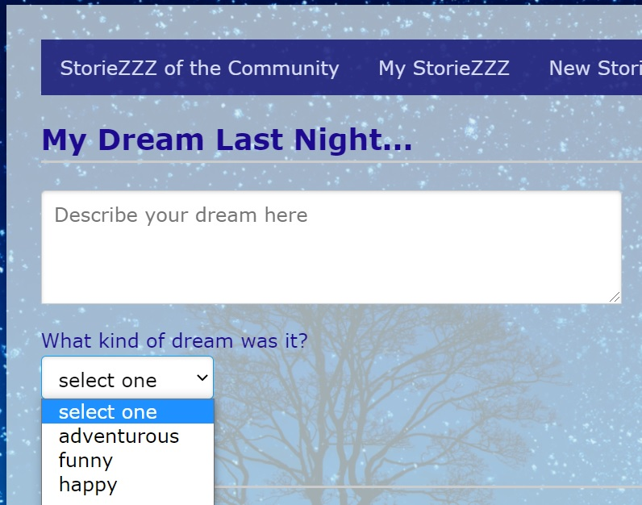

# Sinatra StorieZZZ

Sinatra StorieZZZ is a dream-logging web application that was built using the Sinatra library.  The Corneal gem was utilized to begin the framework.



## Installation

Add this line to your application's Gemfile:

```ruby
gem 'sinatra-storiezzz'
```

And then execute:

    $ bundle

Or install it yourself as:

    $ gem install sinatra-storiezzz

## Usage

To start the server, simply run ` shotgun ` in your terminal.  Then you open the provided url or localhost number to open the app in your browser. 

Sign up with a username, email and password in order to use this app.  Log in dreams by description and category, and these will be posted to the StorieZZZ Community anonymously.  Dreams can also be viewed by category. 

## Contributing

Bug reports and pull requests are welcome on GitHub at https://github.com/maasa-k/sinatra-storiezzz. This project is intended to be a safe, welcoming space for collaboration, and contributors are expected to adhere to the [Contributor Covenant](http://contributor-covenant.org) code of conduct.

## License

The gem is available as open source under the terms of the [MIT License](https://opensource.org/licenses/MIT).

## Code of Conduct

Everyone interacting in the Sinatra StorieZZZ project’s codebases, issue trackers, chat rooms and mailing lists is expected to follow the [code of conduct](https://github.com/maasa-k/sinatra-storiezzz/blob/master/CODE_OF_CONDUCT.md).